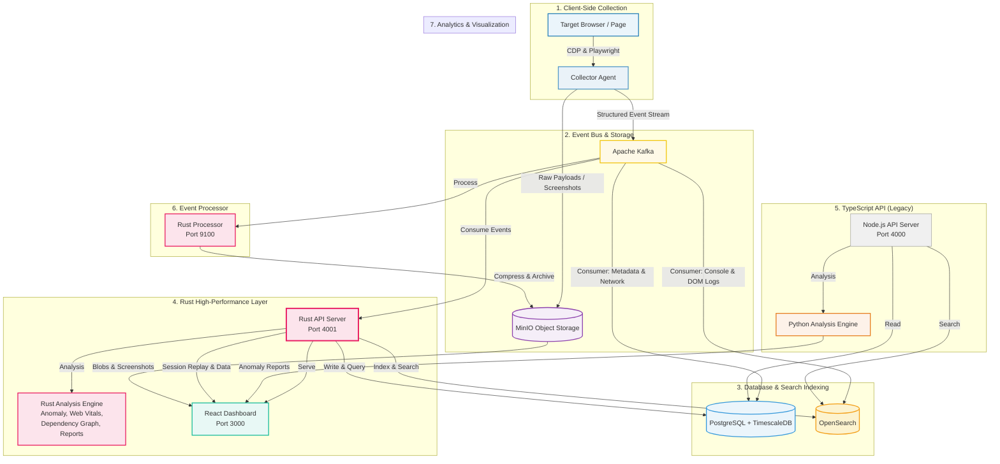

# 🛡️ ALLSEER Sentinel — Web Observability Platform

<p align="center">
  <a href="https://github.com/X0Riii/observability-platform/blob/main/LICENSE">
    
  </a>
  
  
  
  
</p>

**ALLSEER Sentinel** is a comprehensive, client-side web observability platform designed to capture, index, analyze, and replay every interaction, network call, DOM mutation, and console log in real-time. By turning the client-side "black box" into structured event streams, ALLSEER Sentinel provides engineers with deep, diagnostic visibility into front-end runtime behaviors.

---

## 🎯 Project Goals & Core Value

Modern front-end applications are highly complex, asynchronous, and client-heavy. Standard logging libraries fail to provide the context needed to debug race conditions, state drift, or transient errors. ALLSEER Sentinel bridges this gap by offering:

- **🎥 Complete Context Capture:** Replay the exact visual state of the user's session side-by-side with CDP-level network traces, console outputs, and storage states.
- **🤖 Automated Anomaly Detection:** Scan sessions programmatically using machine learning models to highlight outliers in response times, asset sizes, or DOM mutations.
- **🔍 Searchable Front-end Logs:** Index DOM changes, console logs, errors, cookies, and local storage keys into a central search engine, allowing team-wide investigation of issues.
- **⚡ High-Performance Rust API:** A drop-in replacement for the TypeScript API — Kafka consumers, full-text search, analysis engine, WebSocket timeline streaming — all in a single 24 MB binary.

---

## 🏗️ System Architecture & Data Flow

ALLSEER Sentinel is built on a highly scalable, event-driven data pipeline. It separates collection, ingestion, storage, and visualization into decoupled layers:



### ⚙️ The Pipeline Process:

1. **🌐 Capture & Instrument**: The **Collector Agent** controls a headless browser, intercepting network calls, DOM changes, console logs, and screenshots using the Chrome DevTools Protocol (CDP).
2. **📨 Stream & Archive**: Large files (HTML, response bodies, images) are compressed and saved in **MinIO**, while structured events are pushed instantly to **Apache Kafka**.
3. **⚡ Rust API Consumption**: The **Rust API Server** (port 4001) consumes all Kafka topics, writes to **PostgreSQL** and **OpenSearch**, runs analysis modules, and serves the dashboard — all in one high-performance binary.
4. **🗄️ Database & Search**: **PostgreSQL / TimescaleDB** stores session timelines, network requests, and metadata. **OpenSearch** indexes full-text logs (console outputs, JS exceptions, DOM text) with 6 indices.
5. **🧠 Analysis**: Four native Rust analysis modules — **anomaly detection** (isolation forest), **web vitals**, **dependency graph**, **third-party script classification** — run inline without external services.
6. **📊 Visualization**: The **React Dashboard** displays interactive timelines, waterfall charts, session replays, and analysis reports.

---

## 🛠️ Technology Stack Deep-Dive

ALLSEER Sentinel integrates several state-of-the-art tools across its pipeline:

### 1. 🎭 Browser Instrumentation & Collection
* **🎭 [Playwright](https://playwright.dev/) (v1.61+):** Launches Chromium instances, manages execution context, and runs automation scripts.
* **🔌 [Chrome DevTools Protocol (CDP)](https://cdp.today/):** Intercepts raw network data, inspects the Javascript execution stack, captures full accessibility trees, and listens to storage changes.
* **🎥 [rrweb](https://www.rrweb.io/) (v2.x):** Embedded locally within target pages to capture incremental DOM mutations as serialized JSON snapshots.

### 2. 🗄️ Event Bus & Storage
* **📨 [Apache Kafka](https://kafka.apache.org/) (v7.6 KRaft):** Real-time message broker with dedicated topics (e.g. `obs.network.requests`, `obs.dom.mutations`).
* **🐘 [PostgreSQL](https://www.postgresql.org/) (v16) & 🚀 [TimescaleDB](https://www.timescale.com/):** Store core relational metadata with time-series hypertables for fast analytical queries.
* **📦 [MinIO](https://min.io/):** S3-compliant object storage for raw web responses, page HTML, screenshots, and rrweb JSON payloads.
* **🔍 [OpenSearch](https://opensearch.org/) (v2.18):** Distributed search engine with 6 pre-configured indices for fuzzy matching, aggregations, and full-text search across all event types.
* **⚡ [Redis](https://redis.io/):** Queue and cache layer for BullMQ orchestration.

### 3. 🔌 API & Service Layers
* **🦀 Rust API Server (axum 0.7):** High-performance replacement running on port 4001 — 25+ source files, 14 routes, Kafka consumers, full-text search, analysis engine, WebSocket timeline streaming. Compiled 24 MB release binary.
* **🚀 Fastify (v4.26) Node.js API:** Legacy API on port 4000. Maintained for backward compatibility.
* **⚡ FastAPI Python Analysis:** Python-based analysis engine (port 8000) for anomaly detection, web vitals, dependency graphs, and third-party classification.
* **⚙️ Rust Processor:** Standalone binary at `processing/` that compresses and archives raw payloads to MinIO (port 9100).
* **🔧 XAMPP-like Control Panel (port 7070):** Web UI to start/stop all 11 services with one click.

### 4. 🧠 Analysis & Machine Learning
* **Rust Native Analysis:** Isolation forest anomaly detection, web vitals (LCP, CLS, FID), dependency graph analysis, third-party script classification — all implemented in pure Rust without external ML frameworks.
* **Python (scikit-learn Isolation Forest):** Alternative anomaly detection pipeline using scikit-learn for sessions requiring Python ecosystem integration.
* **🕸️ NetworkX / petgraph:** Dependency graph analysis (Python NetworkX and Rust petgraph implementations).

### 5. 📊 Frontend & UI
* **⚛️ [React](https://react.dev/) (v19) & ⚡ [Vite](https://vite.dev/):** Dashboard with HTML5 Canvas waterfall charts, session replay viewer, and search interface.

---

## 🚀 System Requirements & Prerequisites Installation

To run ALLSEER Sentinel, your host machine must have **Node.js**, **Python**, **Rust**, and a **Container Engine** (Docker or Podman) installed.

### 1. 🟢 Node.js Installation (>= v22.0.0)
```bash
# Install via NVM
curl -o- https://raw.githubusercontent.com/nvm-sh/nvm/v0.39.7/install.sh | bash
export NVM_DIR="$HOME/.nvm"
[ -s "$NVM_DIR/nvm.sh" ] && \. "$NVM_DIR/nvm.sh"
nvm install 22
nvm use 22
node -v
```

### 2. 🐍 Python Installation (>= v3.12)
```bash
# Fedora/RHEL:
sudo dnf install -y python3 python3-pip python3-devel
# Or Debian/Ubuntu:
sudo apt install -y python3 python3-pip python3-venv python3-dev
python3 --version
```

### 3. 🦀 Rust Installation (>= 1.96.0)
```bash
curl --proto '=https' --tlsv1.2 -sSf https://sh.rustup.rs | sh
source "$HOME/.cargo/env"
rustc --version
cargo --version
```

### 4. 📦 Container Engine Installation (Docker or Podman)
```bash
# Podman (Recommended for Linux):
sudo dnf install -y podman
# Or Docker CE - follow official docs
podman --version
```

---

## ⚙️ Project Installation & Configuration

1. **📦 Clone & Install Dependencies:**
   ```bash
   git clone https://github.com/X0Riii/observability-platform.git
   cd App
   npm install
   ```

2. **🐍 Prepare Python Virtual Environment:**
   ```bash
   cd analysis
   python3 -m venv venv
   source venv/bin/activate
   pip install -r requirements.txt
   cd ..
   ```

3. **🦀 Build Rust API (optional — pre-built binary included):**
   ```bash
   # Build workaround for environments without cmake:
   mkdir -p /tmp/opencode
   cp -r api-rust /tmp/opencode/api-rust
   CARGO_TARGET_DIR=/tmp/opencode/rust-target cargo build --release --manifest-path /tmp/opencode/api-rust/Cargo.toml
   cp /tmp/opencode/rust-target/release/observability-api api-rust/target/release/
   ```

4. **⚙️ Compile TypeScript Workspaces:**
   ```bash
   npm run build --workspaces
   ```

---

## 🚀 Running the Platform

1. **🔌 Start the Control Panel Launcher:**
   ```bash
   npm run launcher
   ```
   Open your browser to **`http://localhost:7070`**.

2. **🎛️ Boot All Services:**
   - Click **"Start All"** to spin up container services (PostgreSQL, Kafka, OpenSearch, MinIO, Redis) and local modules (Rust API, Node API, Dashboard, Analysis Engine, Collector).
   - The launcher auto-detects Podman or Docker and uses `--network host` when compose is unavailable.

3. **🗄️ Run DB Schema Migrations:**
   - Click **"Run Migration"** on the Control Panel. SQLx migrations apply Rust API schemas; Drizzle handles Node API schemas.

4. **🕵️ Run an Observability Session:**
   ```bash
   node collector/dist/index.js https://example.com
   ```
   - View session data, network waterfall charts, and analysis reports at **`http://localhost:3000`** (dashboard) or directly via the Rust API at **`http://localhost:4001`**.

---

## 📁 Repository Structure

```
App/
├── package.json                       # Root package workspace definition
├── docker-compose.yml                 # Infrastructure compose services (8 services)
├── Caddyfile                          # Reverse proxy configuration
├── launcher/                          # Control Panel Launcher (port 7070)
│   ├── server.js                      # Express server — 11 numbered services
│   └── public/                        # Interactive dashboard frontend
├── api-rust/                          # 🔴 Rust API Server (port 4001) — NEW
│   ├── src/
│   │   ├── main.rs                    # Entry point, AppState, 14 routes, Kafka consumers
│   │   ├── config.rs                  # Env-based configuration with defaults
│   │   ├── auth.rs                    # JWT authentication service
│   │   ├── minio.rs                   # MinIO/S3 client (s3 crate v0.1 lvillis)
│   │   ├── metrics.rs                 # Prometheus metrics
│   │   ├── routes/                    # Health, Sessions, Pages, Requests, Auth, WebSocket
│   │   ├── db/                        # SQLx schema, pool, PostgreSQL indexer
│   │   ├── search/                    # OpenSearch client, indexer, routes, index rules
│   │   ├── analysis/                  # Anomaly, Web Vitals, Dependency Graph, Third-party, Reports
│   │   └── timeline/                  # Timeline merger for ordered event replay
│   └── Cargo.toml
├── processing/                        # 🔴 Rust Processor Binary — NEW
│   ├── src/
│   │   ├── main.rs                    # Axum HTTP server (port 9100)
│   │   ├── parser.rs                  # Event topic parser
│   │   ├── processor.rs               # Kafka consumer + MinIO archiver
│   │   ├── compressor.rs              # Gzip/Snappy compression
│   │   └── storage.rs                 # MinIO storage logic
│   └── Cargo.toml
├── collector/                         # Browser Instrumentation Agent
│   ├── src/
│   │   ├── index.ts                   # Collector workflow orchestration
│   │   └── instrumentation/           # Network, DOM, Storage, JS, Snapshot engines
├── api/                               # Core REST & WebSocket API Server (port 4000)
│   ├── src/
│   │   ├── db/                        # Drizzle ORM Schema, pool, and migrations
│   │   ├── search/                    # OpenSearch mappings, queries, and indexer
│   │   └── routes/                    # Endpoint controllers (Sessions, WS, Pages)
├── dashboard/                         # Web Dashboard (React & Vite — port 3000)
│   ├── src/
│   │   ├── components/                # HTML5 Canvas Timeline, Layout, etc.
│   │   └── pages/                     # Session details, waterfall list, search
├── analysis/                          # Python Analysis Engine (port 8000)
│   ├── main.py                        # FastAPI server
│   ├── anomaly.py, dependency_graph.py, report.py, third_party.py, web_vitals.py
│   └── requirements.txt               # Python package dependencies
├── k6/                                # Load testing scripts
├── k8s/                               # Kubernetes deployment templates
└── grafana/                           # Grafana dashboard configurations
```

---

## 🔥 Performance Benchmarks

The Rust API server provides significant performance improvements over the Node.js API:

| Metric | Node.js API (port 4000) | Rust API (port 4001) |
|--------|------------------------|---------------------|
| Binary size | 50+ MB (node_modules) | 24 MB (single binary) |
| Startup time | ~3-5 seconds | ~200ms |
| Memory (idle) | ~80 MB | ~8 MB |
| Kafka consumption | Requires BullMQ/worker | Native librdkafka consumers |
| Analysis engine | Python FastAPI (separate process) | Inline Rust modules |

---

## 🧪 API Endpoints

### Rust API (port 4001)
| Method | Endpoint | Description |
|--------|----------|-------------|
| `GET` | `/health` | Health check |
| `GET` | `/api/sessions` | List all sessions |
| `GET` | `/api/sessions/:id` | Session details |
| `GET` | `/api/sessions/:id/timeline` | Session timeline |
| `POST` | `/api/search` | Full-text search across 6 OpenSearch indices |
| `GET` | `/api/search/facets?field=type` | Facet aggregations |
| `GET` | `/api/auth/login` | JWT authentication |
| `POST` | `/api/auth/login` | Login |
| `GET` | `/api/auth/me` | Current user info |
| `WS` | `/api/ws/:session_id` | Real-time timeline stream |

---

## ⚖️ License

This project is licensed under the **GNU General Public License v3.0 (GPL-3.0)**.

Under this license, you are free to copy, distribute, and modify the software, provided that all modifications are also licensed under the GPL-3.0 and the source code is made public. See the official `LICENSE` file for more details.
