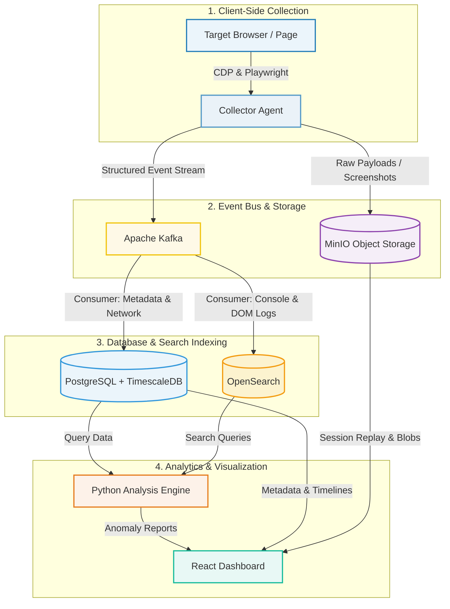

# 🛡️ ALLSEER Sentinel — Web Observability Platform

<p align="center">
  <a href="https://github.com/your-username/allseer-sentinel/blob/main/LICENSE">
    
  </a>
  
  
  
</p>

**ALLSEER Sentinel** is a comprehensive, client-side web observability platform designed to capture, index, analyze, and replay every interaction, network call, DOM mutation, and console log in real-time. By turning the client-side "black box" into structured event streams, ALLSEER Sentinel provides engineers with deep, diagnostic visibility into front-end runtime behaviors.

---

## 🎯 Project Goals & Core Value

Modern front-end applications are highly complex, asynchronous, and client-heavy. Standard logging libraries fail to provide the context needed to debug race conditions, state drift, or transient errors. ALLSEER Sentinel bridges this gap by offering:

- **🎥 Complete Context Capture:** Replay the exact visual state of the user's session side-by-side with CDP-level network traces, console outputs, and storage states.
- **🤖 Automated Anomaly Detection:** Scan sessions programmatically using machine learning models to highlight outliers in response times, asset sizes, or DOM mutations.
- **🔍 Searchable Front-end Logs:** Index DOM changes, console logs, errors, cookies, and local storage keys into a central search engine, allowing team-wide investigation of issues.

---

## 🏗️ System Architecture & Data Flow

ALLSEER Sentinel is built on a highly scalable, event-driven data pipeline. It separates collection, ingestion, storage, and visualization into decoupled layers:



### ⚙️ The Pipeline Process:

1. **🌐 Capture & Instrument**: The **Collector Agent** controls a headless browser, intercepting network calls, DOM changes, console logs, and screenshots using the Chrome DevTools Protocol (CDP).
2. **📨 Stream & Archive**: Large files (HTML, response bodies, images) are compressed and saved in **MinIO**, while structured events are pushed instantly to **Apache Kafka**.
3. **🗄️ Index & Store**: Kafka consumers process the topics:
   - **PostgreSQL / TimescaleDB** stores session timelines, network requests, and metadata.
   - **OpenSearch** indexes full-text logs (console outputs, JS exceptions, DOM text).
4. **🧠 Analyze & Visualize**: The **Analysis Engine** processes the session telemetry for anomalies, and the **React Dashboard** displays beautiful interactive timelines, waterfall charts, and session replays.

---

## 🛠️ Technology Stack Deep-Dive

ALLSEER Sentinel integrates several state-of-the-art tools across its pipeline:

### 1. 🎭 Browser Instrumentation & Collection
* **🎭 [Playwright](https://playwright.dev/) (v1.44+):** Used to launch Chromium instances, manage execution context, and run automation scripts.
* **🔌 [Chrome DevTools Protocol (CDP)](https://cdp.today/):** Intercepts raw network data, inspects the Javascript execution stack, captures full accessibility trees (`Accessibility.getFullAXTree`), and listens to storage changes.
* **🎥 [rrweb](https://www.rrweb.io/) (v2.x):** Embedded locally within target pages to capture incremental DOM mutations and store them as serialized JSON.

### 2. 🗄️ Event Bus & Storage
* **📨 [Apache Kafka](https://kafka.apache.org/) (v3.7):** Serves as the real-time message broker. Organizes messages into distinct topics (e.g. `obs.network.requests`, `obs.dom.mutations`) with dedicated consumer groups for parallel ingestion.
* **🐘 [PostgreSQL](https://www.postgresql.org/) (v16) & 🚀 [TimescaleDB](https://www.timescale.com/):** Store core relational metadata. TimescaleDB partitions request/response sequences into time-series hypertables for fast analytical queries.
* **📦 [MinIO](https://min.io/):** An S3-compliant high-performance object storage server. Used to archive raw web responses, page HTML source structures, screenshots, and rrweb JSON payloads.
* **🔍 [OpenSearch](https://opensearch.org/) (v2.13):** A distributed search and analytics suite. Provides fuzzy matching, aggregations (facets), and search queries across DOM modifications, exceptions, cookies, and network payloads.
* **⚡ [Redis](https://redis.io/) & 🐂 [BullMQ](https://bullmq.io/):** Redis processes the queues. BullMQ orchestrates asynchronous browser crawling tasks and job retries.

### 3. 🔌 API & Web Layers
* **🚀 [Fastify](https://fastify.dev/) (v4.26):** A fast and low-overhead web framework for Node.js. Drives the REST API, serves server-side metrics for Prometheus, and handles real-time timeline streams via WebSockets.
* **⚡ [FastAPI](https://fastapi.tiangolo.com/) (v0.110):** A Python-based framework powering the analysis endpoint.
* **🌧️ [Drizzle ORM](https://orm.drizzle.team/):** A modern TypeScript SQL ORM. Handles PostgreSQL schema migrations, indexes, and queries.

### 4. 🧠 Analysis & Machine Learning
* **🤖 [scikit-learn](https://scikit-learn.org/) (Isolation Forest):** Isolation Forest models detect anomalous network calls (outliers in response sizes or latencies) without requiring pre-labeled training data.
* **🕸️ [NetworkX](https://networkx.org/):** Builds and analyzes directed dependency graphs of page assets and scripts.

### 5. 📊 Frontend & UI
* **⚛️ [React](https://react.dev/) (v19) & ⚡ [Vite](https://vite.dev/):** Renders the dashboard interfaces. Renders waterfall charts on an HTML5 Canvas for fast rendering of large traces.

---

## 🚀 System Requirements & Prerequisites Installation

To run ALLSEER Sentinel, your host machine must have **Node.js**, **Python**, and a **Container Engine** (Docker or Podman) installed. Follow the guides below for your environment:

### 1. 🟢 Node.js Installation (>= v22.0.0)
It is recommended to install Node.js via **NVM (Node Version Manager)** to easily manage runtime versions:

```bash
# 1. Download and install NVM
curl -o- https://raw.githubusercontent.com/nvm-sh/nvm/v0.39.7/install.sh | bash

# 2. Reload shell configuration (or restart terminal)
export NVM_DIR="$HOME/.nvm"
[ -s "$NVM_DIR/nvm.sh" ] && \. "$NVM_DIR/nvm.sh"

# 3. Install and use Node.js 22 LTS
nvm install 22
nvm use 22

# 4. Verify installation
node -v
npm -v
```

### 2. 🐍 Python Installation (>= v3.12)
The Analysis Engine requires Python and its package manager (`pip`):

#### On Debian/Ubuntu:
```bash
sudo apt update
sudo apt install -y python3 python3-pip python3-venv python3-dev
```

#### On Fedora/RHEL:
```bash
sudo dnf install -y python3 python3-pip python3-devel
```

Verify Python installation:
```bash
python3 --version
pip3 --version
```

### 3. 📦 Container Engine Installation (Docker or Podman)
ALLSEER Sentinel automatically detects if you have **Docker** (with Compose) or **Podman**. If compose is unavailable, the Launcher boots container services independently.

#### Option A: Install Podman (Recommended for Linux)
```bash
# Ubuntu/Debian:
sudo apt update
sudo apt install -y podman

# Fedora/CentOS/RHEL:
sudo dnf install -y podman

# Verify Podman installation
podman --version
```

#### Option B: Install Docker CE
Follow the official guides to install [Docker Engine](https://docs.docker.com/engine/install/) for your operating system. Ensure your user is added to the docker group:
```bash
sudo usermod -aG docker $USER
# Log out and log back in to apply group changes
```

---

## ⚙️ Project Installation & Configuration

1. **📦 Clone & Install Project Packages:**
   Clone the repository and install all Node workspace packages:
   ```bash
   npm install
   ```

2. **🐍 Prepare Python Virtual Environment:**
   Set up and install dependencies for the Analysis Engine:
   ```bash
   # Navigate to the analysis folder
   cd analysis
   
   # Create a virtual environment
   python3 -m venv venv
   
   # Activate it
   source venv/bin/activate
   
   # Install requirements
   pip install -r requirements.txt
   
   # Return to root directory
   cd ..
   ```

3. **⚙️ Compile TypeScript Workspaces:**
   Transpile all TypeScript code for the Collector and API modules:
   ```bash
   npm run build --workspaces
   ```

---

## 🚀 Running the Platform

1. **🔌 Start the Control Panel Launcher:**
   ```bash
   npm run launcher
   ```
   Open your browser to **`http://localhost:7070`**.

2. **🎛️ Boot All Services:**
   - In the Launcher Control Panel, click **"Start All"** to spin up container services (PostgreSQL, Kafka, OpenSearch, MinIO, Redis) and local modules (Fastify API, React Dashboard, Python Analysis Engine, and the Collector process).
   - If Podman is detected without compose plugins, the Launcher will automatically run container images natively using `podman run`.

3. **🗄️ Run DB Schema Migrations:**
   - Click the **"Run Migration"** button on the Control Panel page. This applies Drizzle schemas and configures TimescaleDB time-series hypertables.

4. **🕵️ Run a Observability Session:**
   Provide a target URL in the Control Panel UI to trigger a capture, or run the Collector manually from CLI:
   ```bash
   node collector/dist/index.js https://example.com
   ```
   - Replay logs, network assets, and screenshots can be viewed in the dashboard at **`http://localhost:3000`**.

---

## 📁 Repository Structure

```
App/
├── package.json                   # Root package workspace definition
├── docker-compose.yml             # Infrastructure compose services
├── Caddyfile                      # Reverse proxy configuration
├── launcher/                      # Control Panel Launcher package
│   ├── server.js                  # Docker/Podman compatible backend
│   └── public/                    # Interactive dashboard frontend
├── collector/                     # Browser Instrumentation Agent
│   ├── src/
│   │   ├── index.ts               # Collector workflow orchestration
│   │   └── instrumentation/       # Network, DOM, Storage, JS, Snapshot engines
├── api/                           # Core REST & WebSocket API Server
│   ├── src/
│   │   ├── db/                    # Drizzle ORM Schema, pool, and migrations
│   │   ├── search/                # OpenSearch mappings, queries, and indexer
│   │   └── routes/                # Endpoint controllers (Sessions, WS, Pages)
├── dashboard/                     # Web Dashboard (React & Vite)
│   ├── src/
│   │   ├── components/            # HTML5 Canvas Timeline, Layout, etc.
│   │   └── pages/                 # Session details, waterfall list, search
├── analysis/                      # Python Analysis Engine
│   ├── main.py                    # FastAPI server
│   ├── anomaly.py                 # Isolation Forest ML algorithm
│   ├── dependency_graph.py        # Directed dependency graph analysis
│   ├── report.py                  # HTML analytical report generator
│   ├── third_party.py             # Third-party scripts classifier
│   ├── web_vitals.py              # Web Vitals metrics calculator
│   └── requirements.txt           # Python package dependencies
├── k6/                            # k6 Load testing scripts
├── k8s/                           # Kubernetes deployment templates
└── grafana/                       # Grafana dashboard configurations
```

---

## ⚖️ License

This project is licensed under the **GNU General Public License v3.0 (GPL-3.0)**. 

Under this license, you are free to copy, distribute, and modify the software, provided that all modifications are also licensed under the GPL-3.0 and the source code is made public. See the official `LICENSE` file for more details.
